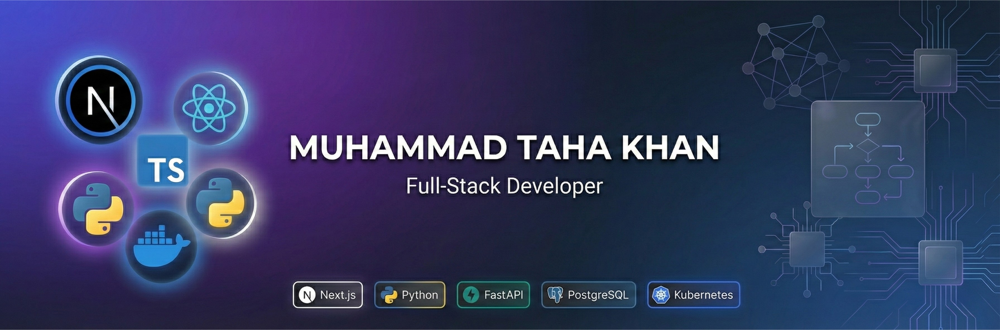

# 👋 Hi, I'm Muhammad Taha Khan

<div align="center">
  
</div>

<div align="center">

[](https://git.io/typing-svg)


</div>

---

## 🚀 About Me

I'm a **Full-Stack Developer** from Pakistan 🇵🇰 with a passion for **building scalable, real-world applications**. I specialize in modern web technologies and AI-powered systems, with a strong focus on **system design** and **application architecture**.

- 🔭 Currently building **production-ready AI agents** and **full-stack web applications**
- 🎯 Focused on **System Design**, **Scalable Architecture**, and **Real-World Solutions**
- 🌱 Diving deep into **Advanced AI/ML**, **Microservices**, and **Cloud-Native Development**
- 💡 Passionate about **LLMs**, **Intelligent Automation**, and **Distributed Systems**
- 🚀 Starting my **Open Source journey** and looking to contribute to impactful projects
- 💬 Ask me about **Next.js, TypeScript, AI Agents, FastAPI, or System Architecture**
- ⚡ Fun fact: I love designing systems before writing a single line of code!

---

## 🛠️ Tech Stack

### Frontend Development


### Backend Development


### Databases & ORMs


### AI & Machine Learning


### Vector Databases


### DevOps & Cloud


### Tools & Development


### Package Managers


---

## 🏆 Featured Projects

### 🤖 [AI Agent SDK Mastery](https://github.com/1089taha/ai-agent-sdk-mastery)
> Production-ready AI agent framework with OpenAI SDK & Gemini API

**Tech Stack:** `Python` `OpenAI Agents SDK` `Gemini API` `FastAPI` `LangChain`

Complete AI agent development suite featuring advanced multi-agent orchestration, web search capabilities, and intelligent guardrails. Built for real-world deployment with smart customer support automation designed specifically for e-commerce applications.

**Key Highlights:**
- Multi-agent systems with OpenAI Agent SDK
- Real-time web search integration and contextual responses
- Production-grade guardrails for safe AI interactions
- Dynamic instruction handling and context management
- Scalable architecture for enterprise deployment

---

### 🏕️ [Hilink Travel Website](https://github.com/1089taha/Hilink-travel-website)
> Modern travel platform with augmented reality maps and intelligent route planning

**Tech Stack:** `TypeScript` `Next.js` `React` `Tailwind CSS`

A fully responsive travel and adventure website showcasing modern web development practices. Features immersive AR map integration, smart route planning algorithms, and real-time campground booking system built with performance optimization at its core.

**Key Highlights:**
- Augmented reality map integration for immersive exploration
- Intelligent route planning with real-time optimization
- Responsive design system optimized for all devices
- Server-side rendering for enhanced SEO and performance
- Clean, maintainable codebase following best practices

---

### 🛍️ [E-Commerce Platform - Hackathon Project](https://github.com/1089taha/hackathon-project)
> Enterprise-grade e-commerce solution with modern UI/UX patterns

**Tech Stack:** `TypeScript` `Next.js` `Tailwind CSS` `ShadCN UI`

Elegant, fully responsive e-commerce platform demonstrating production-ready development practices. Features a polished interface with ShadCN component library, optimized user flows, and seamless navigation designed for maximum conversion rates.

**Key Highlights:**
- Modern, accessible UI built with ShadCN components
- Type-safe development with TypeScript for reliability
- Optimized shopping cart and checkout flow
- Server-side rendering for better SEO and performance
- Responsive design system with Tailwind CSS

---

## 🎯 What I'm Currently Working On

- 🏗️ **System Design:** Architecting scalable, distributed systems and microservices
- 🤖 **AI Engineering:** Building production-ready AI agents with LangChain and OpenAI
- ☁️ **Cloud-Native Development:** Exploring containerization with Docker and Kubernetes
- 📚 **Learning:** Advanced system design patterns, distributed architectures, and MLOps
- 🌟 **Open Source:** Starting my journey to contribute to impactful open-source projects

---

## 💭 My Approach to Development

```text
🎨 Design First     → I architect systems before writing code
🔧 Build for Scale  → Always thinking about production and scalability
📊 Data-Driven      → Leveraging analytics and metrics for decisions
🧪 Test Thoroughly  → Quality and reliability are non-negotiable
🚀 Ship Fast        → Iterative development with continuous improvement
```

---

## 🤝 Let's Connect!

<div align="center">

[](www.linkedin.com/in/taha-khan-306750329)
[](mailto:tahakhalid317@gmail.com)

</div>

---

## 💭 Developer Quote

<div align="center">


</div>

---

<div align="center">
  
### ⚡ "Architecting solutions, one system at a time" ⚡

**Open to collaboration on innovative projects!**

[](https://github.com/1089taha)

</div>

---

<div align="center">
  
</div>
